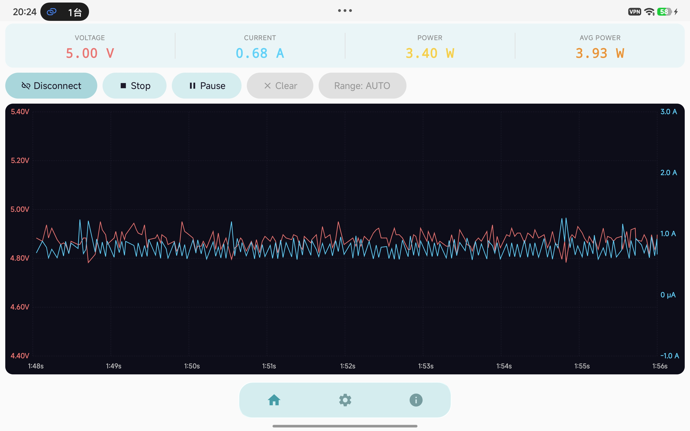
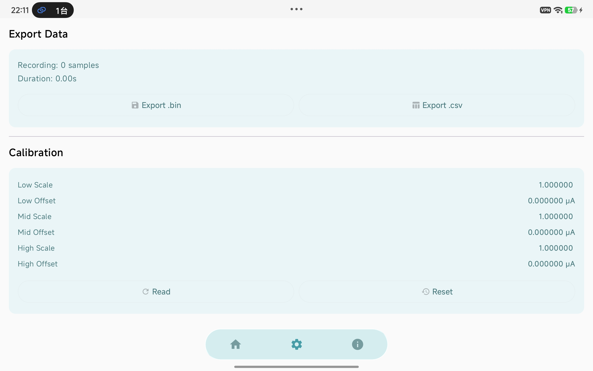
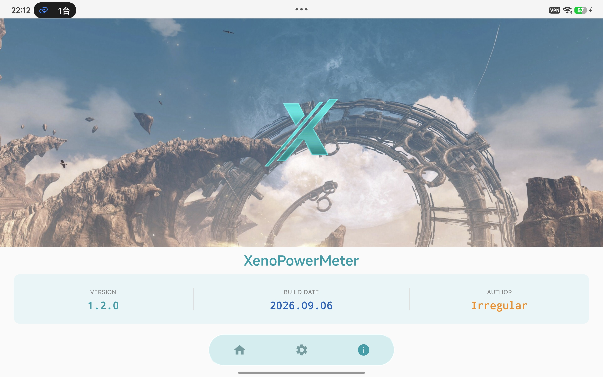
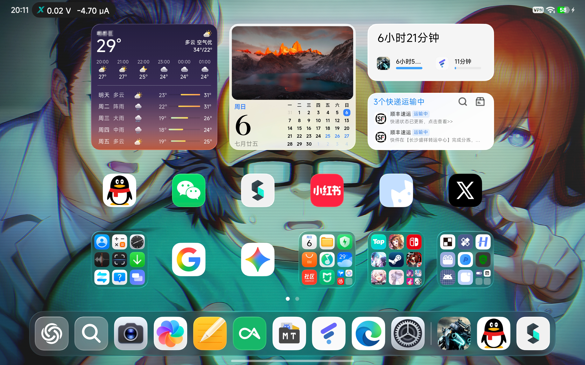
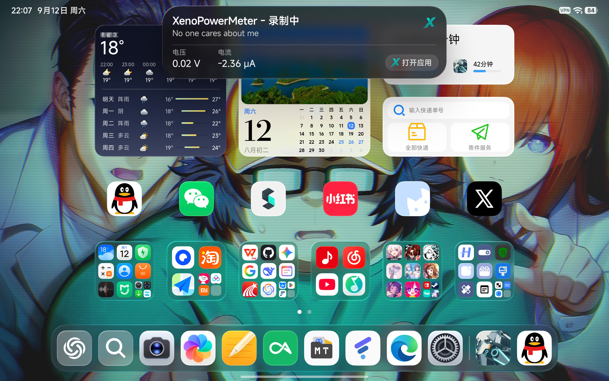
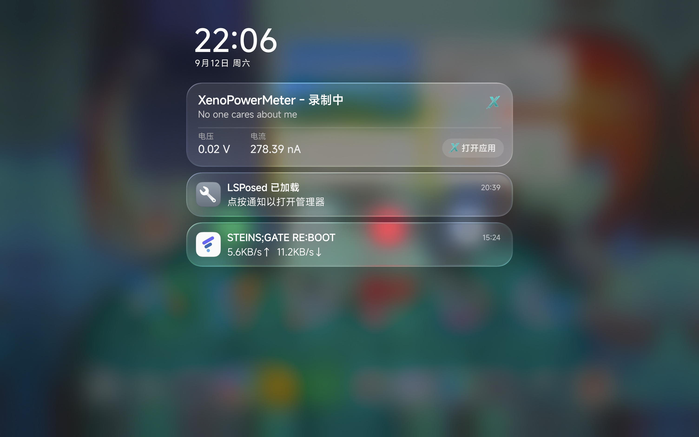
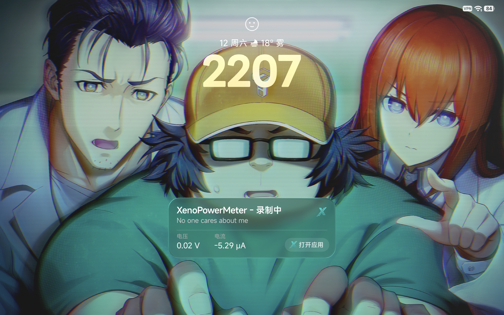

<h1 align="center"><br>XenoPowerMeter<br><span style="display: inline-block; margin-top: 11px;"><sub><sup>An Android app for collecting Power-Pico USB power meter data.</sup></sub></span></h1>

<div align="center">


</div>

<p align="center" style="margin-top: 24px;"><strong>本项目基于<a href="https://github.com/No-Chicken/Power-Pico">Power-Pico</a>以及<a href="https://github.com/No-Chicken/Power-Pico/blob/main/PC_Client/PowerPico_Client_Setup_v0.0.8.exe">PowerPico_Client</a>进行开发，仅适配Power-Pico USB电流表，实现了若干基本功能</strong></p>

----

## 支持功能
- 采集并查看电流、电压、功率等数据
- 导入/导出数据，支持与PC端互通
- 校准设备的部分参数
- 适配Hyper OS超级岛


## 目前已知问题
- 本软件的UI适配较差
- 暂未适配Google Live Updates
- 以上两条后面考虑修复

## 应用界面预览
| <div align="center">主页</div> | <div align="center">设置</div> | <div align="center">关于</div> |
|----------|----------|----------|
|  |  |  |


## 超级岛适配预览
| <div align="center">桌面</div> | <div align="center">桌面展开大卡片</div> | 
|----------|----------|
|  |  | 
| <div align="center"><strong>通知中心卡片</strong></div> | <div align="center"><strong>锁屏卡片</strong></div> | 
|  |  | 

## 项目结构

```
app/src/main/java/com/irregular/xenopowermeter/
├── MainActivity.kt                      
├── ui/                                 // UI相关
│   ├── main/
│   │   └── MainScreen.kt               // 主界面
│   ├── settings/
│   │   └── SettingsScreen.kt           // 设置页
│   ├── about/
│   │   └── AboutScreen.kt              // 关于页 
│   ├── connection/
│   │   └── ConnectionScreen.kt         // 设备连接页(已弃用)
│   ├── navigation/
│   │   └── Navigation.kt               // 导航栏相关
│   └── theme/
│       ├── Theme.kt                    // Material3主题配置
│       └── Color.kt                    // 自定义颜色定义
├── viewmodel/
│   └── WaveformViewModel.kt            // 核心功能：数据采集/图表/录制/USB通信
├── data/
│   ├── model/
│   │   ├── UsbAdcPacket.kt             // USB数据包模型
│   │   ├── Commands.kt                 // MCU通信协议指令
│   │   └── Calibration.kt              // 校准参数模型
│   ├── usb/
│   │   ├── UsbCdcManager.kt            // USB CDC虚拟串口管理
│   │   └── ProtocolParser.kt           // 协议解析器(帧同步/校验/CRC)
│   └── converter/
│       └── DataConverter.kt            // 数据格式化(电压/电流/功率显示)
├── recording/
│   └── Recorder.kt                     // 录制管理(内存存储+.bin/.csv 导出)
└── notification/
    └── IslandHelper.kt                 // 小米HyperOS 超级岛适配
```

## 特别感谢：
- [《异度神剑X 终极版 NS2版》](https://www.nintendo.com/zh-hans-hk/games/switch2/bas6a/index.html)
- [Github - Power-Pico](https://github.com/No-Chicken/Power-Pico)
- [Github - NexioSchedule](https://github.com/HaoZai000/NexioSchedule)
- [Github - Android Liquid Glass](https://github.com/Kyant0/AndroidLiquidGlass)
- 以及陪伴我大学生活的JPRG们